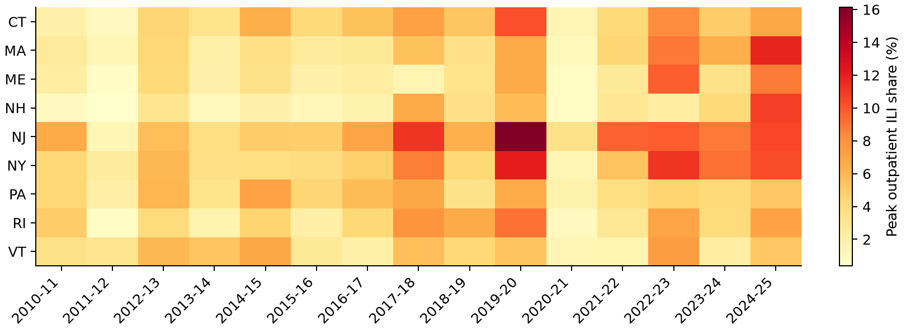
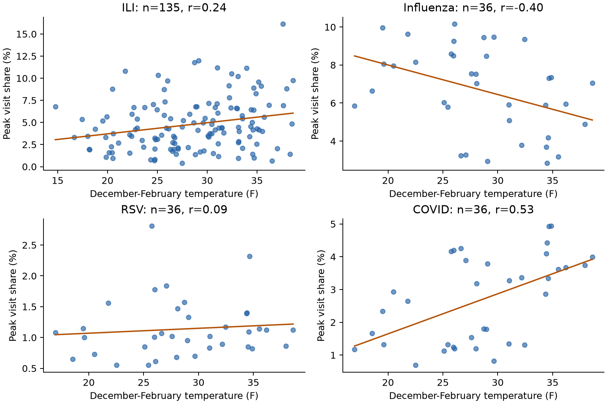
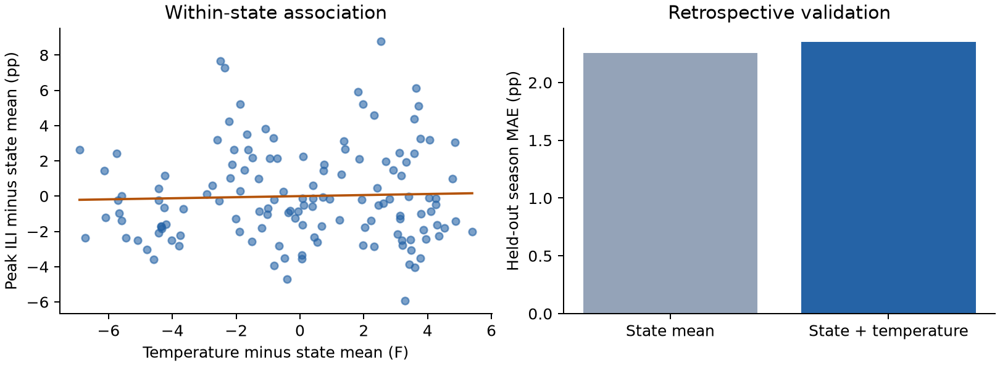
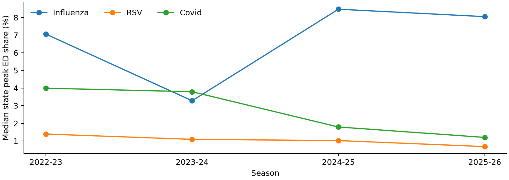

# Winter temperature and respiratory surges in the Northeast

Vitchakorn Poonyakanok | CMU 90-819 | Final insight report | 5 October 2026

Narrative: 800 words (excluding headings, captions, tables, and endnotes).

## Question and motivation

Do colder Northeast winters coincide with larger or earlier respiratory visit surges? This insight report evaluates that question across Connecticut, Maine, Massachusetts, New Hampshire, New Jersey, New York, Pennsylvania, Rhode Island, and Vermont. Hospitals need evidence for seasonal preparedness, but a plausible weather mechanism does not establish a useful planning signal. Prior research links absolute humidity with influenza survival and transmission; temperature alone is an incomplete environmental proxy.[1] The objective here is descriptive: compare surge magnitude and timing, identify differences across pathogens, and assess whether temperature adds information beyond a state's historical experience.

## Data and feature construction

NOAA county monthly temperatures are averaged equally across counties within each state.[2] December, January, and February receive equal weight in the winter mean. CDC-derived Delphi NSSP signals measure influenza, RSV, and COVID shares of reported ED visits, already smoothed over three weeks.[3] FluView measures unweighted outpatient influenza-like illness (ILI), a symptom syndrome rather than laboratory-confirmed influenza.[4] Seasons run from epidemiological week 40 through week 20; outcomes are the maximum weekly share, its earliest tied peak week, and mean seasonal share. Only complete health seasons with all three winter months qualify. NSSP contributes 36 state-seasons per pathogen, covering 2022-23 through 2025-26. Primary FluView analysis uses 135 state-seasons from 2010-11 through 2024-25; the latest season lacks Connecticut and New York. County records retain Census FIPS identifiers as strings to preserve leading zeros.[8] Weekly health records join to the month containing the epidemiological week's Sunday start. This assigns a monthly exposure estimate rather than measuring the actual temperature during each week.

## Descriptive findings

Temperature associations differ by outcome and pathogen. Pooled Pearson correlations with peak share are 0.238 for ILI, -0.398 for influenza ED visits, 0.095 for RSV, and 0.532 for COVID. Spearman correlations give similar peak-share directions.[5] The heatmap reveals pronounced variation across states and seasons. Median state influenza ED peaks rise from 3.28% in 2023-24 to 8.47% in 2024-25; COVID peaks decline from 3.99% in 2022-23 to 1.20% in 2025-26. These contrasting trajectories argue against one common temperature rule. RSV peak timing has a strong pooled correlation with temperature (-0.724), but its direction reverses after state and season adjustment. Geography and shared seasonal conditions therefore matter. The median ILI peak is 4.30%, compared with 7.04% for influenza ED visits, 1.05% for RSV, and 2.90% for COVID. Those percentages describe separate surveillance populations and should not be added or compared as direct measures of disease incidence.

## Adjustment, sensitivity, and validation

Ordinary least squares with state indicators compares warmer and colder winters within states; adding season indicators also absorbs regional shocks common to each season.[6] The ILI within-state slope is 0.030 percentage points per degree Fahrenheit. A 2,000-replicate season-block bootstrap, retaining nine states together, gives an approximate 95% percentile interval of -0.335 to 0.356.[7] This wide interval includes both signs. Excluding 2020-21 leaves the slope essentially unchanged; restricting to pre-pandemic seasons or adding the latest incomplete regional panel changes its sign. Leave-one-season-out validation yields mean absolute error of 2.26 percentage points for state historical means versus 2.35 after adding temperature. This retrospective check uses realized winter temperatures, so it does not establish forecasting performance. Peak share summarizes maximum relative demand, while seasonal mean reduces dependence on season length. Peak timing uses elapsed weeks to avoid the calendar-year discontinuity. State indicators address persistent reporting differences; season indicators address shared temporal variation without asserting that these adjustments remove all confounding.

## Timing and interpretation

Exploratory weekly ILI comparisons use calendar-aligned temperatures from zero through four weeks earlier. Median state correlations range from approximately -0.32 to -0.36, with little separation between lags. Monthly temperatures repeat across weeks, and both illness and weather share seasonality. These correlations therefore cannot identify an independent early-warning delay. Full-winter temperature also includes weather occurring after some respiratory peaks, which prevents interpreting seasonal associations as information available before a surge.

## Planning implications and limitations

Use pathogen-specific surveillance and local capacity indicators to guide preparedness; treat weather as context. Maintain flexible staffing because recent influenza and COVID trajectories diverge. Future work should test daily temperature and humidity alongside vaccination, school calendars, circulating variants, and prior illness, using chronological validation with only information available at prediction time. These ecological results cannot identify individual risk or causal effects. Equal county weighting does not represent population exposure. Visit shares depend on changing denominators and reporting participation; they are not case counts. NSSP county values inherit health-service-area estimates, so county rows are not independent.[3] Four ED seasons and fifteen FluView seasons offer limited independent temporal replication. Bootstrap intervals remain approximate because seasons may themselves be dependent. No causal or clinical thresholds follow from these exploratory results. The reproducibility workflow saves exact analysis samples, sensitivity estimates, lag comparisons, and validation predictions. It checks key uniqueness and input hashes before final delivery. Keeping archived extracts separate from optional downloads allows reviewers to regenerate this submission even when upstream services change. Recommendations should be carefully reassessed as additional seasons become available.

## Statistical outputs

See [all computed tables](../output/tables/) for exact results.

## Endnotes

[1] Shaman J, Kohn M (2009). Absolute humidity modulates influenza survival, transmission, and seasonality. PNAS 106:3243-3248. doi:10.1073/pnas.0806852106. [Source](https://pmc.ncbi.nlm.nih.gov/articles/PMC2651255/). Accessed 5 October 2026.

[2] NOAA NCEI. Monthly U.S. Climate Divisional Database (nClimDiv), county monthly temperature files and format documentation. [Source](https://www.ncei.noaa.gov/pub/data/cirs/climdiv/). Accessed 5 October 2026.

[3] CMU Delphi. NSSP ED Visits: CDC source, 3-week smoothing, reporting coverage, and inherited county geography. [Source](https://cmu-delphi.github.io/delphi-epidata/api/covidcast-signals/nssp.html). Accessed 5 October 2026.

[4] CMU Delphi. FluView (ILINet): ILI definition, unweighted share, state coverage, and revisions. [Source](https://cmu-delphi.github.io/delphi-epidata/api/fluview.html). Accessed 5 October 2026.

[5] SciPy statistical documentation. Pearson product-moment and Spearman rank correlation. Coefficients are descriptive here; independent-row p-values are not used. [Source](https://docs.scipy.org/doc/scipy/reference/stats.html). Accessed 5 October 2026.

[6] NumPy documentation. numpy.linalg.lstsq. OLS uses state indicators, optionally season indicators, and residualizes both temperature and outcomes. [Source](https://numpy.org/doc/stable/reference/generated/numpy.linalg.lstsq.html). Accessed 5 October 2026.

[7] SciPy documentation. Percentile bootstrap procedure. This project implements a season-block adaptation with NumPy, seed 819, 2,000 resamples. [Source](https://docs.scipy.org/doc/scipy/reference/generated/scipy.stats.bootstrap.html). Accessed 5 October 2026.

[8] U.S. Census Bureau. National county FIPS and names reference; used for geographic labels. [Source](https://www2.census.gov/geo/docs/reference/codes/files/national_county.txt). Accessed 5 October 2026.

## Reproducibility and source caveats

Run `python src/reproduce.py` from the repository after installing `requirements.txt`. Raw API extracts are archived under `data/raw/`; SHA-256 hashes are in `manifest.json`. Original download timestamps and NOAA release filename were not recorded, so exact acquisition dates are unknown. The saved NSSP `issue` metadata is not used to infer release chronology. All results use epidemiological week, not issue date. Temperature coverage ends August 2026, ED week 202636, and FluView week 202637. Missing temperature outside analysis seasons is retained rather than imputed. The exact input snapshot is reproducible; live refreshes may revise results.
